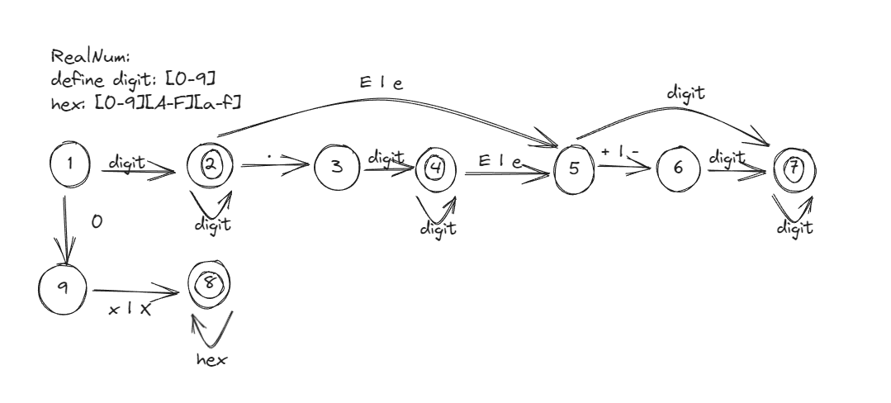
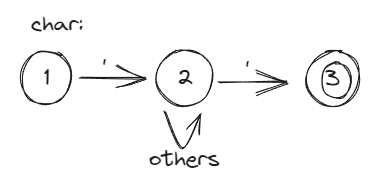
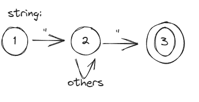
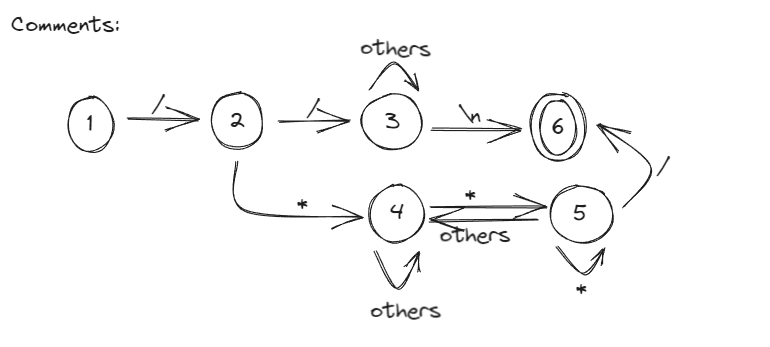

<font face="楷体">

# 编译原理与技术实验一

# C语言词法分析程序的设计与实现

## 要求

1. 选定源语言，比如：C、Pascal、Python、Java等，任何一种语言均可；

2. 可以识别出用源语言编写的源程序中的每个单词符号，并以记号的形式输出每个单词符号。

3. 可以识别并跳过源程序中的注释。

4. 可以统计源程序中的语句行数、各类单词的个数、以及字符总数，并输出统计结果。

5. 检查源程序中存在的词法错误，并报告错误所在的位置。

6. 对源程序中出现的错误进行适当的恢复，使词法分析可以继续进行，对源程序进行一次扫 描，即可检查并报告源程序中存在的所有词法错误。

## 程序设计说明

编写LEX源程序，利用LEX编译程序自动生成词法分析程序。

使用方式：./lexer 手动输入分析文本

### 目录结构

```
├── lexer               可执行程序(Linux下)
├── lex.yy.cc           flex生成的源码
├── lexer.l             编写的语法规则
├── Makefile            工程文件规则
├── report.pdf          设计报告
├── samples             测试文件
├── output              ilegal_input.c对应的输出文件
├── output2-clang       ilegal_input.c对应的clang的输出文件

```

### Token类型及对应的自动机

- Keyword: 关键词。C中的保留字。

- Identifier: 标识符。变量名或函数名。


- Integer:整型常量

- Real Number：实数常量



- Char Constant: 字符常量。如'a'。



- String: 字符串常量。如"bupt\n"。



- Symbol：符号常量。包括以下符号：[] () {} , ; ->

- Operator：运算符常量，如：+ - * / % ++ --

- Comment(并非Token)，支持单行和多行注释



错误处理较为简单，在状态机的非终止状态读取未预料的输入便输出Token(error，str)类型

### 程序实现

```
/*Definitions*/

WHITESPACE [ \t]+

NEWLINE [\r]*[\n]*

/*Keywords*/

KEYWORD "auto"|"break"|"case"|"char"|"const"|"continue"|"default"|"do"|"double"|"else"|"enum"|"extern"|"float"|"for"|"goto"|"if"|"int"|"long"|"register"|"return"|"short"|"signed"|"sizeof"|"static"|"struct"|"switch"|"typedef"|"union"|"unsigned"|"void"|"volatile"|"while"

/*Integer*/
DIGIT ([0-9])
DIGIT_NUM ({DIGIT}+[Ll]?[Uu]?)
Octal_NUM (0[0-7]+[Ll]?[Uu]?)
HEX [0-9A-Fa-f]
HEX_NUM (0[xX]{HEX}+[Ll]?[Uu]?)

/*Character*/
CHARACTER ('[^\\'\n]*')

/*Real Number*/
REAL_NUM ({DIGIT}+\.{DIGIT}+[eE][-+]?{DIGIT}+)

/*String*/
STRING  (\"[^\\\"\n]*\")

/*Identifier*/
LETTER ([A-Za-z])
IDENTIFIER (_|{LETTER}(_|{LETTER}|{DIGIT})*)

/*Symbols*/

SYMBOL ";"|","|":"|"."|"["|"]"|"("|")"|"{"|"}"|"<"|">"

/*Operator*/

OPERATOR  ">"|">>"|">="|">>="|">"|">>"|">="|">>="|"<"|"<<"|"<="|"<<="|"<"|"<<"|"<="|"<<="|"!"|"!="|"="|"=="|"/"|"/="|"*"|"*="|"%"|"%="|"^"|"^="|"|"|"||"|"|="|"?"|"&"|"&&"|"&="|""|"+"|"+="|"++"|""|"-"|"-="|"--"

```

定义了一些正则表达式和宏来描述不同类型的标记。这些正则表达式将在后面的规则中使用：

"/*" ...：匹配多行注释。
```
"/*"    {
            int c;
            while((c = yyinput()) != 0){
                if(c == '\n')
                    ++total_line;
                else if(c == '*'){
                    if((c = yyinput()) == '/')
                        break;
                    else
                        unput(c);
                }
            }
            total_char+=yyleng;
        }
```

"//" ...`：匹配单行注释。

```
"\/\/"  {
            int c;
            while((c = yyinput()) != 0){
                if(c == '\n'){
                    ++total_line;
                    break;
                }
            }
            total_char+=yyleng;
        }
```

{KEYWORD}：匹配关键字，统计关键字数量并输出信息。
```
{KEYWORD}   {
                key_num++;
                printf("Line:%d\tToken(Keyword,%s)\n",total_line,yytext);
                total_char+=yyleng;
            }
```

{IDENTIFIER}：匹配标识符，统计标识符数量并输出信息。
```
{IDENTIFIER}    {
                    id_num++;
                    printf("Line:%d\tToken(Identifier,%s)\n",total_line,yytext);
                    total_char+=yyleng;
                }
```

{Octal_NUM}, {DIGIT_NUM}, {HEX_NUM}, {REAL_NUM}：匹配不同类型的数字，统计数字数量并输出信息。
```
{Octal_NUM} {
                int_num++;
                printf("Line:%d\tToken(Integer,%s)\n",total_line,yytext);
                total_char+=yyleng;
            }
{DIGIT_NUM} {
                int_num++;
                printf("Line:%d\tToken(Integer,%s)\n",total_line,yytext);
                total_char+=yyleng;
            }
{HEX_NUM}   {
                int_num++;
                printf("Line:%d\tToken(Integer,%s)\n",total_line,yytext);
                total_char+=yyleng;
            }
{REAL_NUM}  {
                real_num++;
                printf("Line:%d\tToken(Real_number,%s)\n",total_line,yytext);
                total_char+=yyleng;
            }
```

{CHARACTER} 和 {STRING}：匹配字符和字符串，统计它们的数量并输出信息。
```
{CHARACTER} {
                char_num++;
                printf("Line:%d\tToken(Character,%s)\n",total_line,yytext);
                total_char+=yyleng;
            }
{STRING}    {
                str_num++;
                printf("Line:%d\tToken(String,%s)\n",total_line,yytext);
                total_char+=yyleng;
            }
```

"#"：匹配预处理指令。
```
"#" {
        int c;
        while((c = yyinput()) != 0){
            if(c == '\n'){
                ++total_line;
                break;
            }
        }
        total_char+=yyleng;
    }
```

{SYMBOL} 和 {OPERATOR}：匹配符号和操作符，统计它们的数量并输出信息。
```
{SYMBOL}    {
                sym_num++;
                printf("Line:%d\tToken(Symbol,%s)\n",total_line,yytext);
                total_char+=yyleng;
            }

{OPERATOR}  {
                op_num++;
                printf("Line:%d\tToken(Operator,%s)\n",total_line,yytext);
                total_char+=yyleng;
            }
```

\n 和 {WHITESPACE}：处理换行和空格。
```
{NEWLINE}   {
                total_char+=yyleng;
                total_line++;
            }

{WHITESPACE}    {
                    total_char+=yyleng;
                }
```
.：匹配任何未被上述规则匹配的字符，并输出错误信息。
```

.       {
            total_char+=yyleng;
            printf("Line:%d\tToken(ERROR,%s)\n",total_line,yytext);
        }

```

## 测试结果

[测试用例](samples1/ilegal_input.c)

```
#include "for_gcc_build.hh" // only for gcc, TinyC will ignore it.

int main() {
	int n;
	"asdfsdf
	&
	$

}
```

输出Token流和统计分析信息 [output](output)

```
Line:3	Token(Keyword,int)
Line:3	Token(Identifier,main)
Line:3	Token(Symbol,()
Line:3	Token(Symbol,))
Line:3	Token(Symbol,{)
Line:4	Token(Keyword,int)
Line:4	Token(Identifier,n)
Line:4	Token(Symbol,;)
Line:5	Token(ERROR,")
Line:5	Token(Identifier,asdfsdf)
Line:6	Token(Operator,&)
Line:7	Token(ERROR,$)
Line:9	Token(Symbol,})

Total line:10
Total Text Character:51
Total Identifier:3
Total Keyword:2
Total Integer:0
Total Real Number:0
Total Character:0
Total String:0
Total Operator:1
Total Symbol:5

```

和使用[clang输出结果](output-clang)进行比对，正确的c文件结果完全正确,对于不合法的标识符或数字表达式如：2ab，本人的词法分析器将其解析为<integer,2>和<identifier,ab>，而clang的词法分析器识别为一个数字常量。两者均在语法分析阶段报错.且对于缺少引号的情况，本人的词法分析器将其解析为<ERROR,">和<identifier,....>，而clang的词法分析器识别为一个unknown整体

```
int 'int'        [StartOfLine]  Loc=<.\samples1\ilegal_input.c:3:1>
identifier 'main'        [LeadingSpace] Loc=<.\samples1\ilegal_input.c:3:5>        
l_paren '('             Loc=<.\samples1\ilegal_input.c:3:9>
r_paren ')'             Loc=<.\samples1\ilegal_input.c:3:10>
l_brace '{'      [LeadingSpace] Loc=<.\samples1\ilegal_input.c:3:12>
int 'int'        [StartOfLine] [LeadingSpace]   Loc=<.\samples1\ilegal_input.c:4:2>
identifier 'n'   [LeadingSpace] Loc=<.\samples1\ilegal_input.c:4:6>
semi ';'                Loc=<.\samples1\ilegal_input.c:4:7>
unknown '"asdfsdf'       [StartOfLine] [LeadingSpace]   Loc=<.\samples1\ilegal_input.c:5:2>
amp '&'  [StartOfLine] [LeadingSpace]   Loc=<.\samples1\ilegal_input.c:6:2>
identifier '$'   [StartOfLine] [LeadingSpace]   Loc=<.\samples1\ilegal_input.c:7:2>
r_brace '}'      [StartOfLine]  Loc=<.\samples1\ilegal_input.c:9:1>
eof ''          Loc=<.\samples1\ilegal_input.c:9:2>
```

</font>