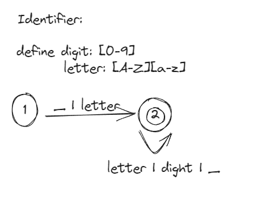
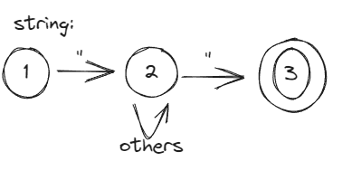
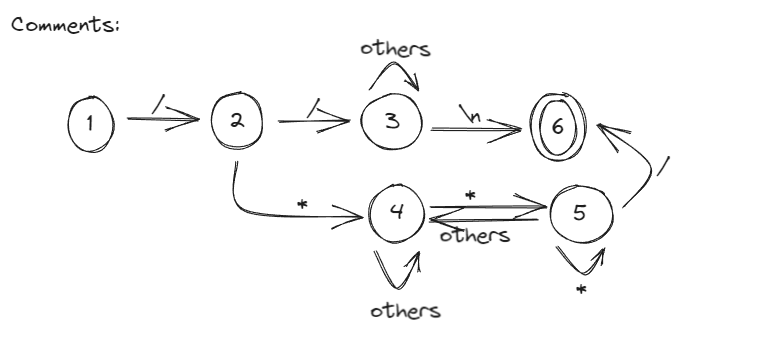
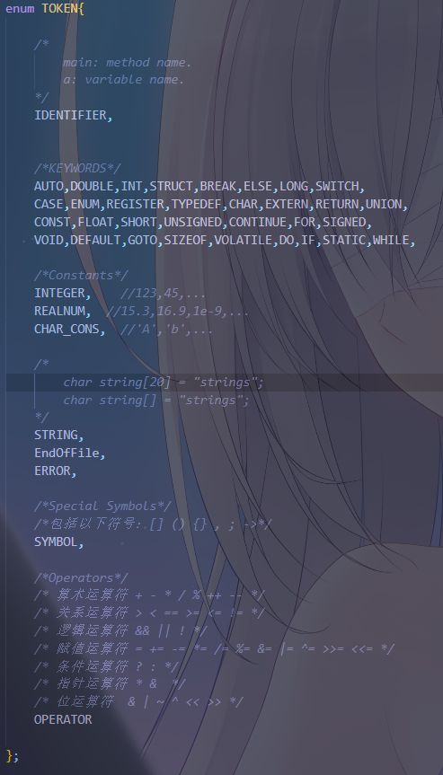
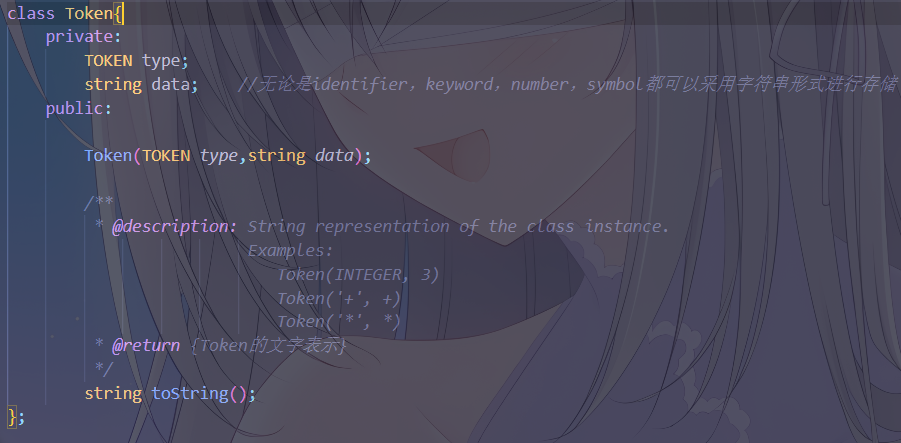
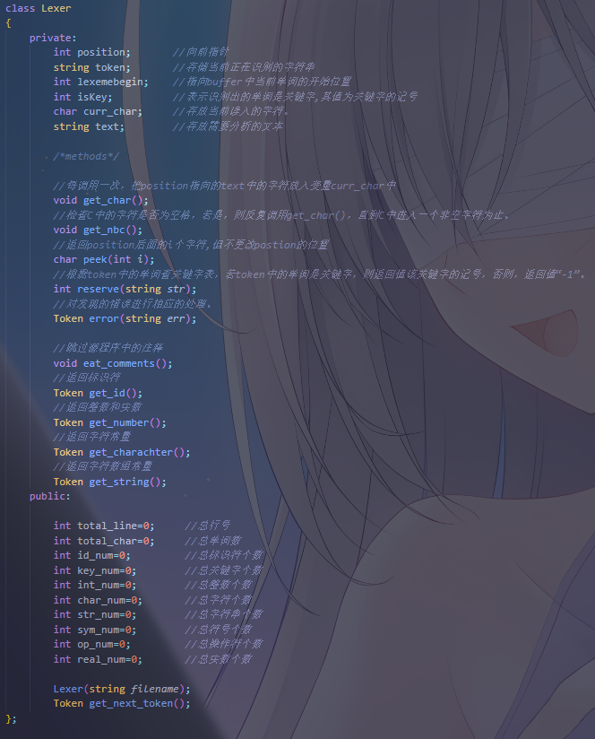
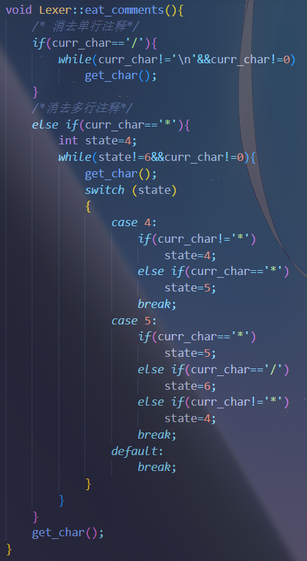

<font face="楷体">

# 编译原理与技术实验一

# C语言词法分析程序的设计与实现

## 要求

1. 选定源语言，比如：C、Pascal、Python、Java等，任何一种语言均可；

2. 可以识别出用源语言编写的源程序中的每个单词符号，并以记号的形式输出每个单词符号。

3. 可以识别并跳过源程序中的注释。

4. 可以统计源程序中的语句行数、各类单词的个数、以及字符总数，并输出统计结果。

5. 检查源程序中存在的词法错误，并报告错误所在的位置。

6. 对源程序中出现的错误进行适当的恢复，使词法分析可以继续进行，对源程序进行一次扫 描，即可检查并报告源程序中存在的所有词法错误。

## 程序设计说明

采用C/C++作为实现语言，手工编写词法分析程序

使用方式：./lexer filename1 [filename2 ...]

eg: ./lexer test1.c

### 目录结构

```
├── lexer               可执行程序(Windows下)
├── main.cpp            主程序
├── lexer.cpp           语法分析类实现
├── lexer.h             语法分析类声明
├── Makefile            工程文件规则
├── report.pdf          设计报告
├── test1.c             较复杂的测试文件
├── test2.c             较简单的测试文件
├── output1             对应的输出文件
├── output2             对应的输出文件
├── output2-clang       clang的输出文件

```

### Token类型及对应的自动机

- Keyword: 关键词。C中的保留字。

- Identifier: 标识符。变量名或函数名。



- Integer:整型常量

- Real Number：实数常量


- Char Constant: 字符常量。如'a'。


- String: 字符串常量。如"bupt\n"。



- Symbol：符号常量。包括以下符号：[] () {} , ; ->

- Operator：运算符常量，如：+ - * / % ++ --

- Comment(并非Token)，支持单行和多行注释



错误处理较为简单，在状态机的非终止状态读取未预料的输入便输出Token(error，str)类型

### 程序实现

定义了枚举类型，Token类和Lexer类







仅对Comment和identifier的自动机实现进行分析，其余的大同小异



首先，它检查当前字符是否是斜杠 /。如果是斜杠，那么它进入单行注释的处理。

单行注释处理：

进入单行注释后，它使用一个循环来读取字符，直到遇到换行符 \n 或文件结束符号 0 为止。这样，它将消耗掉整行的注释内容，直到换行符或文件结束。

如果当前字符不是斜杠 / 而是星号 *，那么它进入多行注释的处理。

多行注释处理：

进入多行注释后，它初始化一个状态变量 state 为4。

然后，它使用一个循环来读取字符，直到状态变量 state 的值变为6或遇到文件结束符号 0 为止。

在循环内部，它使用一个switch语句根据状态变量的值来处理字符。

state的可能取值和处理逻辑如下：

state=4：如果当前字符不是星号 *，则保持在状态4。

state=5：如果当前字符是星号 *，则保持在状态5。

state=6：如果当前字符是斜杠 /，则将状态变为6，表示多行注释结束。

在默认情况下，如果当前字符既不是星号 * 也不是斜杠 /，则将状态变回4。

这个处理逻辑将一直运行，直到多行注释的结束标记 */ 被找到（状态变为6），或者遇到文件结束。

最后，无论是单行注释还是多行注释，都会调用 get_char() 函数来获取下一个字符，以便继续分析源代码的其余部分。


首先，它清空名为 token 的字符串，以准备接收新的标识符。

接下来，它检查当前字符是否是下划线 _。如果是下划线，它将下划线添加到 token 中，并通过 get_char() 函数获取下一个字符。

然后，它进入一个循环，该循环会一直运行，直到遇到文件结束符号 0 或当前字符不是字母、数字或下划线 _ 为止。

在循环内部，它将当前字符添加到 token 中，并通过 get_char() 获取下一个字符。这样，它将连续读取字符，构建标识符，直到遇到非标识符字符或文件结束。

在循环结束后，它调用 reserve 函数，将 token 中的字符串与关键字表进行比较。如果 token 是关键字，isKey 将被设置为关键字的标识符；否则，isKey 将被设置为-1，表示 token 是普通标识符。

根据 isKey 的值，它返回一个相应的 Token：

如果 isKey 等于-1，表示 token 是普通标识符，那么它创建一个标识符类型的 Token，其类型为 IDENTIFIER，内容为 token，然后返回。

如果 isKey 不等于-1，表示 token 是一个关键字，那么它创建一个对应关键字类型的 Token，类型由 isKey 决定，内容为 token，然后返回。

## 测试结果

简单的[测试用例](test2.c)

```
int judge(long long a);

int main()
{
    int n,x;
    int num[11]={0};
    scanf("%d",&n);
    long long a;
    for(x=0;x<n;x++)
    {
        scanf("%lld",&a);
        num[judge(a)]++;
    }
    for(x=1;x<11;x++)
        printf("%d\n",num[x]);
    return 0;
}

int judge(long long a)
{
    if(a<10)
        return 1;
    else
        return (1+judge(a/10));
}
```

输出Token流和统计分析信息 [output2](output2)

```
Token(keyword,int)
Token(identifier,judge)
Token(symbol,()
Token(keyword,long)
Token(keyword,long)
Token(identifier,a)
Token(symbol,))
Token(symbol,;)
Token(keyword,int)
Token(identifier,main)
Token(symbol,()
Token(symbol,))
Token(symbol,{)
Token(keyword,int)
Token(identifier,n)
Token(symbol,,)
Token(identifier,x)
Token(symbol,;)
Token(keyword,int)
Token(identifier,num)
Token(symbol,[)
Token(integer,11)
Token(symbol,])
Token(operator,=)
Token(symbol,{)
Token(integer,0)
Token(symbol,})
Token(symbol,;)
Token(identifier,scanf)
Token(symbol,()
Token(string,%d)
Token(symbol,,)
Token(operator,&)
Token(identifier,n)
Token(symbol,))
Token(symbol,;)
Token(keyword,long)
Token(keyword,long)
Token(identifier,a)
Token(symbol,;)
Token(keyword,for)
Token(symbol,()
Token(identifier,x)
Token(operator,=)
Token(integer,0)
Token(symbol,;)
Token(identifier,x)
Token(operator,<)
Token(identifier,n)
Token(symbol,;)
Token(identifier,x)
Token(operator,++)
Token(symbol,))
Token(symbol,{)
Token(identifier,scanf)
Token(symbol,()
Token(string,%lld)
Token(symbol,,)
Token(operator,&)
Token(identifier,a)
Token(symbol,))
Token(symbol,;)
Token(identifier,num)
Token(symbol,[)
Token(identifier,judge)
Token(symbol,()
Token(identifier,a)
Token(symbol,))
Token(symbol,])
Token(operator,++)
Token(symbol,;)
Token(symbol,})
Token(keyword,for)
Token(symbol,()
Token(identifier,x)
Token(operator,=)
Token(integer,1)
Token(symbol,;)
Token(identifier,x)
Token(operator,<)
Token(integer,11)
Token(symbol,;)
Token(identifier,x)
Token(operator,++)
Token(symbol,))
Token(identifier,printf)
Token(symbol,()
Token(string,%d\n)
Token(symbol,,)
Token(identifier,num)
Token(symbol,[)
Token(identifier,x)
Token(symbol,])
Token(symbol,))
Token(symbol,;)
Token(keyword,return)
Token(integer,0)
Token(symbol,;)
Token(symbol,})
Token(keyword,int)
Token(identifier,judge)
Token(symbol,()
Token(keyword,long)
Token(keyword,long)
Token(identifier,a)
Token(symbol,))
Token(symbol,{)
Token(keyword,if)
Token(symbol,()
Token(identifier,a)
Token(operator,<)
Token(integer,10)
Token(symbol,))
Token(keyword,return)
Token(integer,1)
Token(symbol,;)
Token(keyword,else)
Token(keyword,return)
Token(symbol,()
Token(integer,1)
Token(operator,+)
Token(identifier,judge)
Token(symbol,()
Token(identifier,a)
Token(operator,/)
Token(integer,10)
Token(symbol,))
Token(symbol,))
Token(symbol,;)
Token(symbol,})

File Name:test2.c
Total line:25
Total Text Character:362
Total Identifier:29
Total Keyword:18
Total Integer:10
Total Real Number:0
Total Character:0
Total String:3
Total Operator:13
Total Symbol:57

```

和使用[clang输出结果](output-clang)进行比对，正确的c文件结果完全正确

```
int 'int'        [StartOfLine]  Loc=<test2.c:1:1>
identifier 'judge'       [LeadingSpace] Loc=<test2.c:1:5>
l_paren '('             Loc=<test2.c:1:10>
long 'long'             Loc=<test2.c:1:11>
long 'long'      [LeadingSpace] Loc=<test2.c:1:16>
identifier 'a'   [LeadingSpace] Loc=<test2.c:1:21>
r_paren ')'             Loc=<test2.c:1:22>
semi ';'                Loc=<test2.c:1:23>
int 'int'        [StartOfLine]  Loc=<test2.c:3:1>
identifier 'main'        [LeadingSpace] Loc=<test2.c:3:5>
l_paren '('             Loc=<test2.c:3:9>
r_paren ')'             Loc=<test2.c:3:10>
l_brace '{'      [StartOfLine]  Loc=<test2.c:4:1>
int 'int'        [StartOfLine] [LeadingSpace]   Loc=<test2.c:5:5>
identifier 'n'   [LeadingSpace] Loc=<test2.c:5:9>
comma ','               Loc=<test2.c:5:10>
identifier 'x'          Loc=<test2.c:5:11>
semi ';'                Loc=<test2.c:5:12>
int 'int'        [StartOfLine] [LeadingSpace]   Loc=<test2.c:6:5>
identifier 'num'         [LeadingSpace] Loc=<test2.c:6:9>
l_square '['            Loc=<test2.c:6:12>
numeric_constant '11'           Loc=<test2.c:6:13>
r_square ']'            Loc=<test2.c:6:15>
equal '='               Loc=<test2.c:6:16>
l_brace '{'             Loc=<test2.c:6:17>
numeric_constant '0'            Loc=<test2.c:6:18>
r_brace '}'             Loc=<test2.c:6:19>
semi ';'                Loc=<test2.c:6:20>
identifier 'scanf'       [StartOfLine] [LeadingSpace]   Loc=<test2.c:7:5>
l_paren '('             Loc=<test2.c:7:10>
string_literal '"%d"'           Loc=<test2.c:7:11>
comma ','               Loc=<test2.c:7:15>
amp '&'         Loc=<test2.c:7:16>
identifier 'n'          Loc=<test2.c:7:17>
r_paren ')'             Loc=<test2.c:7:18>
semi ';'                Loc=<test2.c:7:19>
long 'long'      [StartOfLine] [LeadingSpace]   Loc=<test2.c:8:5>
long 'long'      [LeadingSpace] Loc=<test2.c:8:10>
identifier 'a'   [LeadingSpace] Loc=<test2.c:8:15>
semi ';'                Loc=<test2.c:8:16>
for 'for'        [StartOfLine] [LeadingSpace]   Loc=<test2.c:9:5>
l_paren '('             Loc=<test2.c:9:8>
identifier 'x'          Loc=<test2.c:9:9>
equal '='               Loc=<test2.c:9:10>
numeric_constant '0'            Loc=<test2.c:9:11>
semi ';'                Loc=<test2.c:9:12>
identifier 'x'          Loc=<test2.c:9:13>
less '<'                Loc=<test2.c:9:14>
identifier 'n'          Loc=<test2.c:9:15>
semi ';'                Loc=<test2.c:9:16>
identifier 'x'          Loc=<test2.c:9:17>
plusplus '++'           Loc=<test2.c:9:18>
r_paren ')'             Loc=<test2.c:9:20>
l_brace '{'      [StartOfLine] [LeadingSpace]   Loc=<test2.c:10:5>
identifier 'scanf'       [StartOfLine] [LeadingSpace]   Loc=<test2.c:11:9>
l_paren '('             Loc=<test2.c:11:14>
string_literal '"%lld"'         Loc=<test2.c:11:15>
comma ','               Loc=<test2.c:11:21>
amp '&'         Loc=<test2.c:11:22>
identifier 'a'          Loc=<test2.c:11:23>
r_paren ')'             Loc=<test2.c:11:24>
semi ';'                Loc=<test2.c:11:25>
identifier 'num'         [StartOfLine] [LeadingSpace]   Loc=<test2.c:12:9>
l_square '['            Loc=<test2.c:12:12>
identifier 'judge'              Loc=<test2.c:12:13>
l_paren '('             Loc=<test2.c:12:18>
identifier 'a'          Loc=<test2.c:12:19>
r_paren ')'             Loc=<test2.c:12:20>
r_square ']'            Loc=<test2.c:12:21>
plusplus '++'           Loc=<test2.c:12:22>
semi ';'                Loc=<test2.c:12:24>
r_brace '}'      [StartOfLine] [LeadingSpace]   Loc=<test2.c:13:5>
for 'for'        [StartOfLine] [LeadingSpace]   Loc=<test2.c:14:5>
l_paren '('             Loc=<test2.c:14:8>
identifier 'x'          Loc=<test2.c:14:9>
equal '='               Loc=<test2.c:14:10>
numeric_constant '1'            Loc=<test2.c:14:11>
semi ';'                Loc=<test2.c:14:12>
identifier 'x'          Loc=<test2.c:14:13>
less '<'                Loc=<test2.c:14:14>
numeric_constant '11'           Loc=<test2.c:14:15>
semi ';'                Loc=<test2.c:14:17>
identifier 'x'          Loc=<test2.c:14:18>
plusplus '++'           Loc=<test2.c:14:19>
r_paren ')'             Loc=<test2.c:14:21>
identifier 'printf'      [StartOfLine] [LeadingSpace]   Loc=<test2.c:15:9>
l_paren '('             Loc=<test2.c:15:15>
string_literal '"%d\n"'         Loc=<test2.c:15:16>
comma ','               Loc=<test2.c:15:22>
identifier 'num'                Loc=<test2.c:15:23>
l_square '['            Loc=<test2.c:15:26>
identifier 'x'          Loc=<test2.c:15:27>
r_square ']'            Loc=<test2.c:15:28>
r_paren ')'             Loc=<test2.c:15:29>
semi ';'                Loc=<test2.c:15:30>
return 'return'  [StartOfLine] [LeadingSpace]   Loc=<test2.c:16:5>
numeric_constant '0'     [LeadingSpace] Loc=<test2.c:16:12>
semi ';'                Loc=<test2.c:16:13>
r_brace '}'      [StartOfLine]  Loc=<test2.c:17:1>
int 'int'        [StartOfLine]  Loc=<test2.c:19:1>
identifier 'judge'       [LeadingSpace] Loc=<test2.c:19:5>
l_paren '('             Loc=<test2.c:19:10>
long 'long'             Loc=<test2.c:19:11>
long 'long'      [LeadingSpace] Loc=<test2.c:19:16>
identifier 'a'   [LeadingSpace] Loc=<test2.c:19:21>
r_paren ')'             Loc=<test2.c:19:22>
l_brace '{'      [StartOfLine]  Loc=<test2.c:20:1>
if 'if'  [StartOfLine] [LeadingSpace]   Loc=<test2.c:21:5>
l_paren '('             Loc=<test2.c:21:7>
identifier 'a'          Loc=<test2.c:21:8>
less '<'                Loc=<test2.c:21:9>
numeric_constant '10'           Loc=<test2.c:21:10>
r_paren ')'             Loc=<test2.c:21:12>
return 'return'  [StartOfLine] [LeadingSpace]   Loc=<test2.c:22:9>
numeric_constant '1'     [LeadingSpace] Loc=<test2.c:22:16>
semi ';'                Loc=<test2.c:22:17>
else 'else'      [StartOfLine] [LeadingSpace]   Loc=<test2.c:23:5>
return 'return'  [StartOfLine] [LeadingSpace]   Loc=<test2.c:24:9>
l_paren '('      [LeadingSpace] Loc=<test2.c:24:16>
numeric_constant '1'            Loc=<test2.c:24:17>
plus '+'                Loc=<test2.c:24:18>
identifier 'judge'              Loc=<test2.c:24:19>
l_paren '('             Loc=<test2.c:24:24>
identifier 'a'          Loc=<test2.c:24:25>
slash '/'               Loc=<test2.c:24:26>
numeric_constant '10'           Loc=<test2.c:24:27>
r_paren ')'             Loc=<test2.c:24:29>
r_paren ')'             Loc=<test2.c:24:30>
semi ';'                Loc=<test2.c:24:31>
r_brace '}'      [StartOfLine]  Loc=<test2.c:25:1>
eof ''          Loc=<test2.c:25:2>
```

另外一个复杂的[测试用例](test1.c),得到输出[output1](output1)

和clang的词法分析结果进行比对：对于不合法的标识符或数字表达式如：2ab，本人的词法分析器将其解析为<integer,2>和<identifier,ab>，而clang的词法分析器识别为一个数字常量。两者均在语法分析阶段报错

</font>