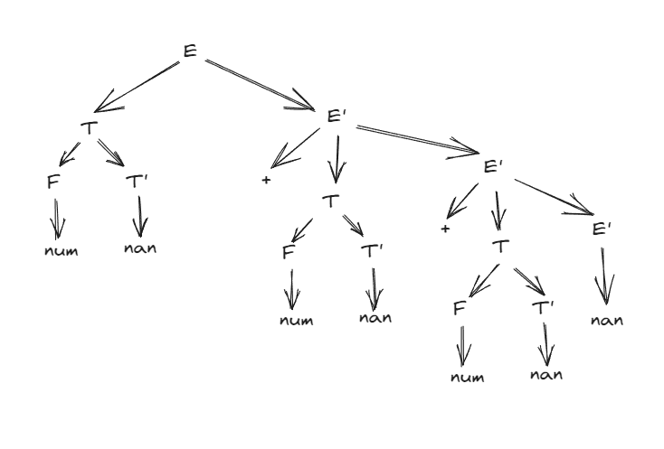

<font face="Consolas">

# 语法分析程序的设计与实现（LL分析方法）

# 实验内容及要求

编写LL(1)语法分析程序，实现对算术表达式的语法分析。要求所分析算数表达式由如下的文法产生：

E→E+T | E–T | T

T→T*F | T/F | F

F→(E) | num

在对输入的算术表达式进行分析的过程中，依次输出所采用的产生式。

# 程序设计说明

## 语法分析流程

程序流程较为简单：

```
Parser parser;
parser.set_expr_set();
parser.set_first_table();
parser.set_follow_table();
parser.set_llTable();
parser.analyze();
```

首先将消除左递归后的文法输入到程序中，之后由人工手动计算出First Set 和 Follow Set输入，最后由程序计算出LLTable，然后运行分析程序

消除左递归后的文法：

```
E->TE'
E'->+TE'
E'->-TE'
E'-> nan
T->FT'
T'->*FT'
T'->/FT'
T'-> nan
F->(E)
F-> num
```

计算出的First Set和Follow Set

|X|First Set|Follow Set|
|----|----|-----|
|E|(,num|$,)|
|E'|+,-,ε|$,)|
|T|(,num|$,+,-,)|
|T'|*,/,ε|$,+,-,)|
|F'|(,num|$,+,-,*,/,)|

计算LLTable过程如下：

```cpp
void Parser::set_llTable() {
  Symbol terminal[8] = {add, sub, mul, divd, leftparen, rightparen, number};
  Symbol non_terminal[5] = {E, E_, T, T_, F};
  /*
   *  将llTable初始化为NULL
   * */

  for (int i = 0; i < 5; i++) {
    for (int j = 0; j < 7; j++) {
      llTable[make_pair(non_terminal[i], terminal[j])] =
          Experiation(ERROR, vector<Symbol>{});
    }
  }

  for (int i = 0; i < expr_set.size(); i++) {
    Symbol alpha = expr_set[i].to[0];
    /*
     * for (每个终结符号a in FIRST(alpha))
     *    把A→alpha放入M[A, a] 中;
     * */
    for (int j = 0; j < 8; j++) {
      if (is_first_set(terminal[j], alpha))
        llTable[make_pair(expr_set[i].from, terminal[j])] = expr_set[i];
    }
    /*
     * if (epsilon in FIRST(alpha))
     *  for (任何b in FOLLOW(A))
     *    把A→alpha放入M[A, b] 中;
     * */
    if (is_first_set(epsilon, alpha)) {
      for (int j = 0; j < follow_set[expr_set[i].from].size(); j++)
        llTable[make_pair(expr_set[i].from, follow_set[expr_set[i].from][j])] =
            expr_set[i];
    }
  }
}
```

初始化 llTable：这个循环嵌套用于初始化 LL 表，将其所有条目初始化为默认值 Experiation(ERROR, vector<Symbol>{})，其中 Experiation 是一种结构，它包含错误信息和产生式的向量。

for (int i = 0; i < expr_set.size(); i++)：这个循环迭代遍历一个名为 expr_set 的集合，包含文法的产生式。

Symbol alpha = expr_set[i].to[0];：在内部循环中，代码获取当前产生式的右侧的第一个符号，并将其存储在 alpha 变量中。

内部循环（for (int j = 0; j < 8; j++)）：这个循环遍历终结符数组 terminal，以检查当前产生式是否可以在 LL 表中填充对应的条目。这是基于 FIRST 集合的信息。is_first_set(terminal[j], alpha) 函数用于检查是否终结符 terminal[j] 属于 alpha 的 FIRST 集合。

if (is_first_set(epsilon, alpha))：这个条件检查 epsilon 是否包含在 alpha 的 FIRST 集合中。如果是，表示 alpha 可以产生空（ε），那么内部循环迭代遍历 FOLLOW 集合，并填充对应的 LL 表条目。

分析程序过程如下：

```cpp
void Parser::analyze() {
  FlexLexer *lexer = new yyFlexLexer;
  int token = 0;
  vector<pair<Symbol, string>> token_list;
  // 得到token流
  while (token = lexer->yylex()) {
    if (int2Symbol(token) == EndOfFile)
      break;
    token_list.push_back(make_pair(int2Symbol(token), string(lexer->YYText())));
  }
  token_list.push_back(make_pair(End, "$"));
  Symbol terminal[7] = {add, sub, mul, divd, leftparen, rightparen, number};
  Symbol non_terminal[5] = {E, E_, T, T_, F};

  stack<Symbol> st;
  int cnt = 0;
  st.push(End);
  st.push(E);
  /*
   * 判断符号是否为terminal
   * */
  auto isTerminal = [terminal](Symbol judge) {
    for (int i = 0; i < 7; i++) {
      if (judge == terminal[i])
        return true;
    }
    return false;
  };
  do {
    Symbol sym = token_list[cnt].first;
    Symbol top = st.top();
    if (isTerminal(top) || top == End) {
      if (top == sym) {
        st.pop();
        cnt++;
      } else
        cout << "ERROR" << endl;
    } else if (llTable[make_pair(top, sym)].from != ERROR) {
      st.pop();
      for (int i = llTable[make_pair(top, sym)].to.size() - 1; i >= 0; i--) {
        if (llTable[make_pair(top, sym)].to[i] != epsilon)
          st.push(llTable[make_pair(top, sym)].to[i]);
      }
      cout << llTable[make_pair(top, sym)] << endl;
    } else
      cout << "ERROR" << endl;
  } while (st.top() != End);
}
```

首先利用flex得到token_list，然后获取当前输入标记的 Symbol 类型和栈顶的符号。如果 top 是终结符或 End，则检查是否与当前输入符号 sym 匹配。如果匹配，从堆栈中弹出 top，并移动到下一个输入符号。如果 top 不是终结符，它是一个非终结符。在这种情况下，根据 LL 表中的信息，从 llTable 中获取相应的产生式，并将产生式右侧的符号逆序压入堆栈。如果 llTable 中没有相应的产生式，或者无法匹配 top 和 sym，则发生错误。循环继续，直到堆栈顶部为 End，表示已成功完成语法分析。

## 辅助输出

```
ostream &operator<<(ostream &os, const Experiation &c) {
  os << symbol2char(c.from);
  if (c.from != ERROR)
    os << "->";
  for (int i = 0; i < c.to.size(); i++)
    os << symbol2char(c.to[i]);
  return os;
}
```

对Experiation的输出进行重载，将 Experiation 对象中的 from 成员转换为字符，并将其输出到流中。如果 from 不是错误符号，继续输出产生式箭头 "->"。循环遍历 c.to，这是 Experiation 对象的 to 成员，其中存储了产生式的右侧符号序列，将每个符号转换为字符并输出到流中。

# 测试用例

[测试用例](demo.txt)：1+2+3

输出为：

```
E->TE'
T->FT'
F-> num 
T'-> nan 
E'->+TE'
T->FT'
F-> num 
T'-> nan 
E'->+TE'
T->FT'
F-> num 
T'-> nan 
E'-> nan 
```
按照此顺序可以构造出一棵正确的AST：



</font>