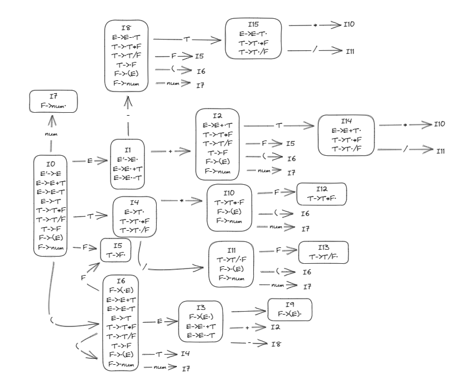

<font face="Consolas">

# 语法分析程序的设计与实现（LL分析方法）

# 实验内容及要求

编写LR语法分析程序，实现对算术表达式的语法分析。要求所分析算数表达式由如下的文法产生: 

E→E+T | E–T | T

T→T*F | T/F | F

F→(E) | num

在对输入的算术表达式进行分析的过程中，依次输出所采用的产生式。

# 程序设计说明

## 语法分析流程

对文法进行拓广:

```
1. E'->E
2. E→E+T 
3. E→E–T 
4. E→T
5. T→T*F 
6. T→T/F 
7. T→F
8. F→(E)
9. F→num
```

构造LR(0)项目集规范族:



由图可见，LR(0)文法存在shift-reduce冲突，但是通过follow set便可解决，因此文法为SLR(1)文法

||First Set|Follow Set|
|----|----|----|
|E'|+,-(,num|+, -, ),$|
|E|+,-,(,num|+, -,), $|
|T|*, /,(,num|+, -, *, /, ),$|
|F|(,num|+, -, *, /, ),$|

得到如下所示分析表:

|    |+   |\-  |*   |/   |(   |)   |num |$   |E'  |E   |T   |F   |
|----|----|----|----|----|----|----|----|----|----|----|----|----|
|0   |    |    |    |    |S6  |    |S7  |    |    |1   |4   |5   |
|1   |S2  |S8  |    |    |    |    |    |ACC |    |    |    |    |
|2   |    |    |    |    |S6  |    |S7  |    |    |    |14  |5   |
|3   |S2  |S8  |    |    |    |S9  |    |    |    |    |    |    |
|4   |R4  |R4  |S10 |S11 |    |R4  |    |R4  |    |    |    |    |
|5   |R7  |R7  |R7  |R7  |    |R7  |    |R7  |    |    |    |    |
|6   |    |    |    |    |S6  |    |S7  |    |    |3   |4   |5   |
|7   |R9  |R9  |R9  |R9  |    |R9  |    |R9  |    |    |    |    |
|8   |    |    |    |    |S6  |    |S7  |    |    |    |15  |5   |
|9   |R8  |R8  |R8  |R8  |    |R8  |    |R8  |    |    |    |    |
|10  |    |    |    |    |S6  |    |S7  |    |    |    |    |12  |
|11  |    |    |    |    |S6  |    |S7  |    |    |    |    |13  |
|12  |R5  |R5  |R5  |R5  |    |R5  |    |R5  |    |    |    |    |
|13  |R6  |R6  |R6  |R6  |    |R6  |    |R6  |    |    |    |    |
|14  |R2  |R2  |S10 |S11 |    |R2  |    |R2  |    |    |    |    |
|15  |R3  |R3  |S10 |S11 |    |R3  |    |R3  |    |    |    |    |

核心代码如下:

```c
do{
    int now_state=state_stack.top();
    Symbol a=token_list[ptr].first;
    if(parsing_table[make_pair(now_state,a)].oper=='S'){
      oper_stack.push(a);
      state_stack.push(parsing_table[make_pair(now_state,a)].num);
      ptr++;
    }
    else if(parsing_table[make_pair(now_state,a)].oper=='R'){
      Experiation expr=expr_set[parsing_table[make_pair(now_state,a)].num-1];
      cout<<expr<<endl;
      for(int i=0;i<expr.to.size();i++){
        oper_stack.pop();
        state_stack.pop();
      }
      state_stack.push(parsing_table[make_pair(state_stack.top(),expr.from)].num);
      oper_stack.push(expr.from);
    }
    else if(parsing_table[make_pair(now_state,a)].oper=='A'){
      return;
    }
    else if(parsing_table[make_pair(now_state,a)].oper=='E'){
      cout<<"ERROR"<<endl;
      exit(-1);
    }
  }while(true);
```

do { ... } while (true);：这是一个无限循环，也就是说，程序会一直在这个循环内执行直到遇到 return 语句或 exit 语句。

int now_state = state_stack.top();：这里获取了状态栈的顶部元素，通常表示当前分析状态。

Symbol a = token_list[ptr].first;：这里从输入符号列表中取出下一个符号，通常是待分析的输入符号。

接下来的一系列 if 语句根据分析表 (parsing_table) 中的信息来执行不同的操作：

如果分析表中对应的操作是 'S'（Shift），则将符号入栈 (oper_stack.push(a))，并将状态入栈 (state_stack.push(parsing_table[make_pair(now_state,a)].num))，然后指针 (ptr) 向前移动。

如果操作是 'R'（Reduce），则从表达式集合 (expr_set) 中取出对应的表达式，输出该表达式，并从状态栈和操作栈中弹出一些元素，然后将新的状态和操作推入栈中。

如果操作是 'A'（Accept），则返回，表示成功分析完成。

如果操作是 'E'（Error），则输出错误信息并退出程序。

[程序示例](demo.txt):1*(1+(1*(2-(4/3+(5-9*3/2)))))/5*3-2+5

输出
```
F-> num 
T->F
F-> num 
T->F
E->T
F-> num 
T->F
F-> num 
T->F
E->T
F-> num 
T->F
F-> num 
T->T/F
E->T
F-> num 
T->F
E->T
F-> num 
T->F
F-> num 
T->T*F
F-> num 
T->T/F
E->E-T
F->(E)
T->F
E->E+T
F->(E)
T->F
E->E-T
F->(E)
T->T*F
E->T
F->(E)
T->F
E->E+T
F->(E)
T->T*F
F-> num 
T->T/F
F-> num 
T->T*F
E->T
F-> num 
T->F
E->E-T
F-> num 
T->F
E->E+T
```

</font>